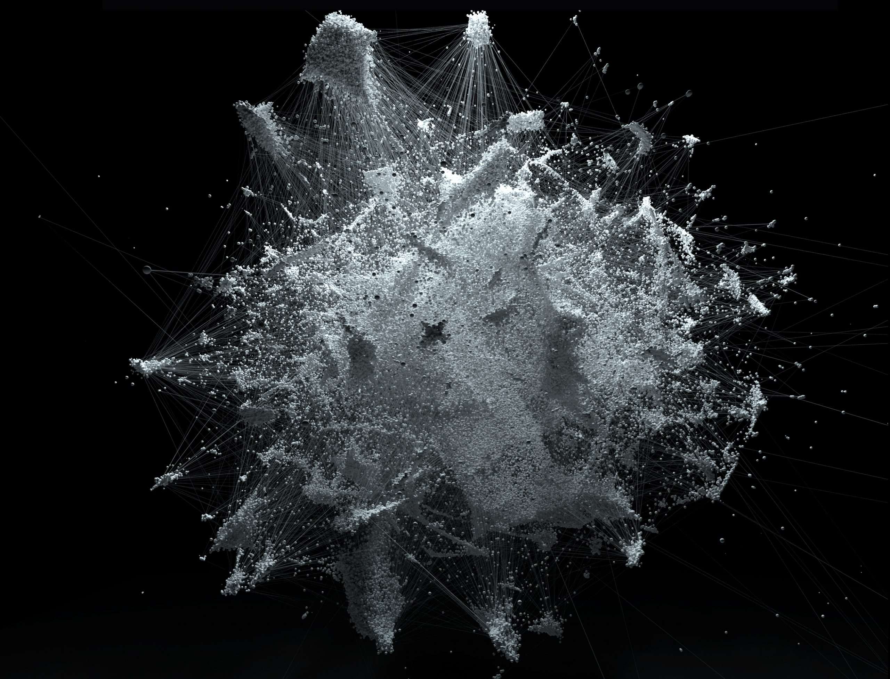
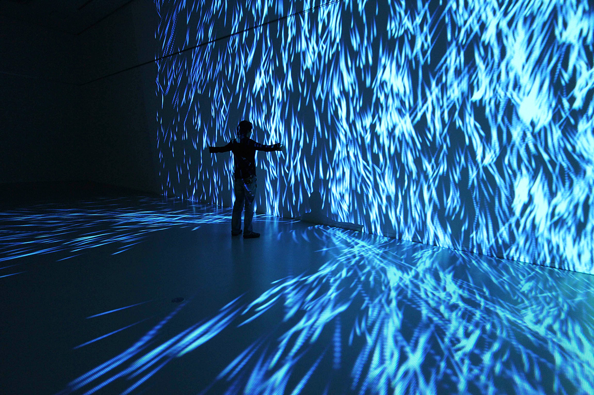

#Quiz_8

#Part 1 - Imaging Technique Inspriation

1. Particle Systems is the technique which I find inspiring for my assignment.

2. Particle systems play a vital role in the art of interactive settings. Particle systems can produce complex, mesmerising visual effects that are both beautiful and engaging. At the same time, it can also respond to sounds, such as changing its own arrangement or colour according to the frequency of the sound, etc. It can bring a double impact to users both visually and emotionally.Particle systems are highly interactive and respond to user input.

3. Here are my inspiration pictures：

#Part 2 - Coding Technique Exploration

1. The particle system is a code technology that can be implemented in p5.js. We can find many examples of particle systems in GitHub. What they have in common is that they are highly interactive.

2. Example coding [Link Text](https://github.com/VincentGarreau/particles.js/blob/master/particles.js)
As can be seen in the example, users can change the shape and color of particles themselves and interact directly with the screen. For example: "particles.shape.type" or "particles.color.value". The former can adjust the shape and state of particles and the latter can adjust their color to improve user engagement.